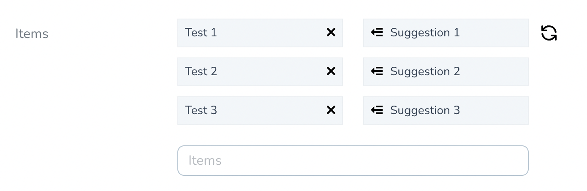

# A suggestion list field for Nova apps

This package contains a Nova field to automatically generate suggestions based on an array of strings using GPT-3.



## Installation

You can install the package in to a Laravel app that uses [Nova](https://nova.laravel.com) via composer:

```bash
composer require siteorigin/nova-suggestion-list-field
```

## Usage

Add the `Siteorigin\NovaSuggestionList\SuggestionList` field in your Nova resource:


```php
namespace App\Nova;

use Siteorigin\NovaSuggestionList\SuggestionList;

class User extends Resource
{
    // ...
    
    public function fields(Request $request)
    {
        return [
            // ...
            
            SuggestionList::make('Items'),

            // ...
        ];
    }
}
```

## Allowing auto refresh suggestion

If you need to refresh the suggestions after each list update you can call the `autorefresh` method.

```php
SuggestionList::make('Items')->autorefresh(),
```

## Options for the GPT-3 Suggester

You can also change the GPT-3 Suggester configuration using the `suggesterOptions` method.

```php

SuggestionList::make('Items')
                    ->suggesterOptions([
                        'engine' => 'davinci'
                    ]),
```
